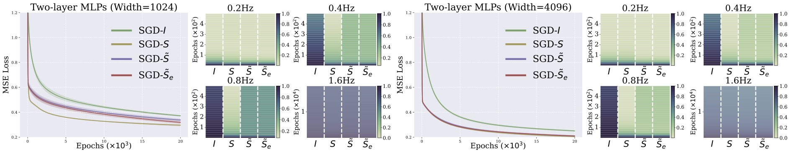
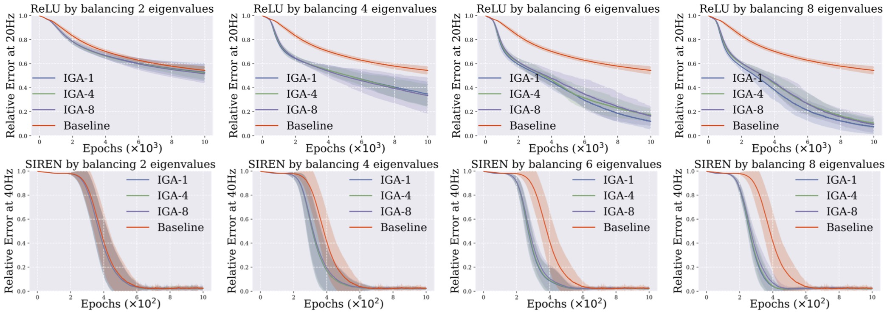
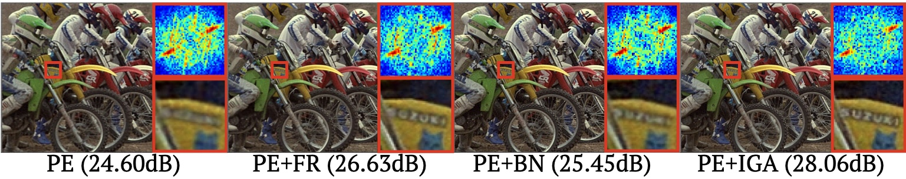
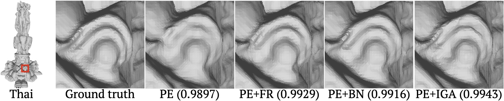

# 🧠 Inductive Gradient Adjustment (IGA)  
*A theory-grounded gradient adjustment method for improving spectral bias in implicit neural representations (INRs).*

## 🎥 High-Frequency Recovery with IGA vs. FR vs. Baselines


## 🔍 Overview

This repository “IGA-INR” contains the official implementation of **IGA**, as proposed in our paper: 
> **Inductive Gradient Adjustment for Spectral Bias in Implicit Neural Representations**<br>
> *Kexuan Shi, Hai Chen, Leheng Zhang, Shuhang Gu*   
> Accepted to **ICML 2025**·  [arXiv](https://arxiv.org/abs/2410.13271). [Openreview](https://openreview.net/forum?id=pYMZQtkp3F).

IGA is a practical and theory-grounded method that improves the training dynamics of Implicit Neural Representations (INRs) by adjusting gradients based on inductive generalization of sampled gradient transformation matrix derived from empirical Neural Tangent Kernel (eNTK) matrix. Compared to vanilla training methods, our IGA encourages better learning of high-frequency signals such as texture and edges without modifying model architectures. This repository provides everything needed to reproduce the experiments from the paper.

---
## ✨ Highlights

- 📈 **Consistent improvements** across diverse INR architectures and tasks.
- 🔬 **Theoretical and empirical justification** of eNTK-based and inductively generalized transformations.
- 🧩 **Plug-in training strategy**, applicable to existing INR pipelines with minimal changes.
- 🖥️ **Runs efficiently** on a single 24GB GPU (e.g., RTX 3090), with reasonable memory and compute overhead.

---
## 🧰 Environment
```bash
cd IGA-INR
conda create --name iga-inr --file requirements.txt

```
---
## 🚀 Getting Started
### 🧠➡️💻 Practical Implementation method

In theory, our method modifies the gradient update by inserting a transformation matrix \( S \) as follows:  
$\nabla_{\theta} f(x, \theta)^\top r_t \quad \Rightarrow \quad \nabla_{\theta} f(x, \theta)^\top S r_t$, where $r_t=f(x-\theta)-y$.

However, directly modifying the gradient in this form is not the most optimal implementation due to potential numerical precision discrepancies. In practice, we apply the transformation matrix directly to the loss function. The modified loss $\mathcal{L}'$ is defined as:

$\mathcal{L}=\frac{1}{N}\sum_{i=1}^N (f(x_i,\theta)-y_i)^2 \Rightarrow \mathcal{L}'=\frac{2}{N}f(x,\theta)^TSr$.

This allows our method to be seamlessly integrated into existing training pipelines with minimal changes to the codebase. 
### 📉 Simple Function Approximation
This section reproduces the experiments in **Section 4** of our paper.

📊 Experiment 1: NTK-based adjustments VS. eNTK-based adjustments

This experiment investigates the difference between NTK-based adjustments and eNTK-based adjustments.

To study how width affects approximation, run the following scripts:
```bash
cd simple_function_approximation/experiment1
sh train_1024.sh
sh train_2048.sh
sh train_4096.sh
sh train_8192.sh
```
> 

⚙️ Experiment 2: Validation of NTK-based Adjustments and IGA in General Settings

In this experiment, we aim to validate the effectiveness of the eNTK-based adjustment and IGA to overcome spectral bias in more general settings.

```bash
cd simple_function_approximation/experiment2
sh train_relu.sh # Using ReLU activation
sh train_siren.sh # Using Sine activation
```
> 

### 🖼️ 2D Color Image Approximation
In the 2D image fitting experiments, we provide training scripts corresponding to the activation functions discussed in the main paper. To reproduce the results, please follow the steps below:

```bash
cd image_fitting
sh train_relu.sh # Using ReLU activation
sh train_relu_pe.sh # Using ReLU activation with Positional Encoding
sh train_siren.sh # Using Sine activation
sh train_finer.sh # Using Finer activation
```

Upon completion, the results will be automatically stored in the “results/” directory. The file “frequency_domain_of_2D_image.ipynb” contains the code for the spectral analysis and visualization as presented in the main text.
Run the following file to calculate the remaining quantitative metrics.

```bash
python lpips_ssim.py
```
> 

### 🗿 3D Shape Representation

In the 3D shape representation, we provide pre-processed 3D data files along with training scripts. To reproduce the results shown in the paper, please follow the steps below:

```bash
cd occupance_fitting
sh train_relu.sh # Using ReLU activation
sh train_pe.sh # Using ReLU activation with Positional Encoding
sh train_sin.sh # Using Sine activation
```
> 

### 📸 5D Neural Radiance Fields

The neural radiance field (NeRF) experiment code is based on [nerf-pytorch](https://github.com/yenchenlin/nerf-pytorch). We made modifications on top of this implementation to suit our experimental needs. To reproduce the results shown in the paper, please follow the steps below:

```bash
cd nerf-pytorch-master
sh train.sh
```

---
## 📄 Citation

If you find this work useful, please consider citing:

```bibtex
@misc{shi2024inductivegradientadjustmentspectral,
      title={Inductive Gradient Adjustment For Spectral Bias In Implicit Neural Representations}, 
      author={Kexuan Shi and Hai Chen and Leheng Zhang and Shuhang Gu},
      year={2024},
      eprint={2410.13271},
      archivePrefix={arXiv},
      primaryClass={cs.CV},
      url={https://arxiv.org/abs/2410.13271}, 
}
```
